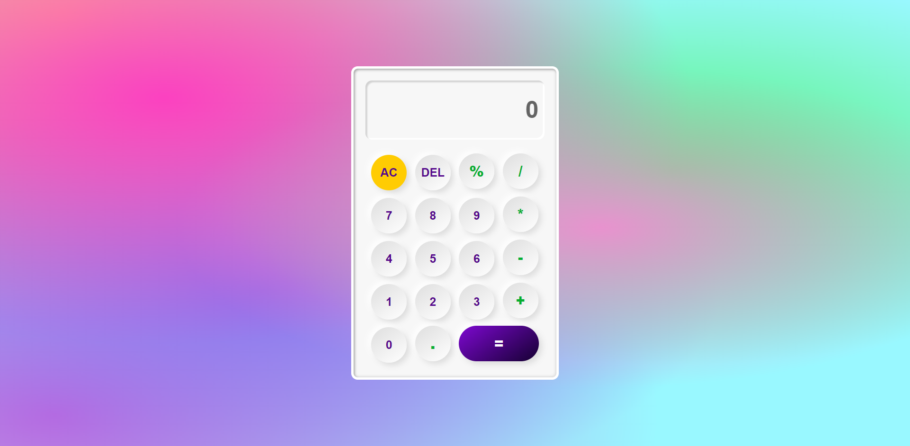

# Calculator App ⌨

- A simple, beautiful Calculator app using HTML CSS & Vanilla JavaScript.

## Project's🚀 [Live Link](https://arpit-calculator.netlify.app/)🔗

>by Arpit Pathak

### Screenshot

## 📌 What I learned from this Project? 📝

- Learned about `radial-gradient()` function in CSS for creating background.
- Learned to make Neumorphic design with the combination of `box-shadow` and `linear-gradient`.
- Learned to make beautiful 3D buttons and Calculator ui with the help of gradient and inset shadowing.
- Learned about `querySelector` and `querySelectorAll`.
- I learned how to attach an event handler to a specific element with the help of `addEventListener()`.
- Learned about  `forEach()`, `eval()` and `slice()` method.
- Learned about `.value` and `.innerHTML`

## 📌 Time taken to finish this project ⏳
- 3 hours
---
 

